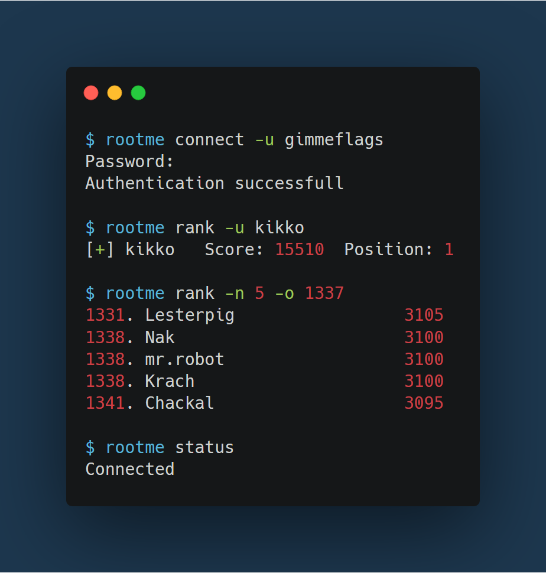

## Overview

This Python package offers some basic feature in order to interact with
root-me.org API.

At first I just needed a way to connect from a server without X. Then, I wrote
a whole Python package, because I like the idea of connecting easily, from
any machine running Python.

This package is not affiliated in any way with the root-me.org association.

## Installation

```sh
pip install -r requirements.txt
pip install -U .
rootme -h
```

I may publish the package to Pypi later.

## Usage

```sh
usage: rootme [-h] {connect,rank,status} ...

root-me.org cli utility.

It offers some basic utility to interact with the root-me.org API.

Available features:

    * connect to the root-me.org. Can be used to access challenges without
      authenticating to the web portal.
    * display ranking for one or more users
    * display ranking, for x elements, starting with an offset of y.
    * check if the connection to root-me.org is active

The cookie created on login is saved on disk. The path can be customized thanks
to the ROOTME_COOKIE_PATH environment variable. By default, the file created is
$HOME/.rootme-spip-session. If HOME environment variable is not available, the
cookie is created in /tmp.

positional arguments:
  {connect,rank,status}

optional arguments:
  -h, --help            show this help message and exit

```

**connect** subcommand:

```sh
usage: rootme connect [-h] -u USERNAME [-p PASSWORD]

optional arguments:
  -h, --help            show this help message and exit
  -u USERNAME, --username USERNAME
                        Username is required
  -p PASSWORD, --password PASSWORD
                        Asked interactively if omitted
```

**rank** subcommand:

```sh
usage: rootme rank [-h] [-u [USER [USER ...]]] [-n NUMBER] [-o OFFSET]

optional arguments:
  -h, --help            show this help message and exit

user:
  Show rank for one or more users

  -u [USER [USER ...]], --user [USER [USER ...]]
                        Search user(s) in ranking. Note: case sensitive

ranking:
  List users in ranking

  -n NUMBER, --number NUMBER
                        Show the <n> top challengers. Cannot exceed 49.
  -o OFFSET, --offset OFFSET
                        Start displaying at <offset>
```

**status** subcommand. This command can be used without arguments.

```sh
usage: rootme status [-h]

optional arguments:
  -h, --help  show this help message and exit
```

## Python stuff

Code is checked with several tools in order to maintain a certain code quality.

- Typing is checked with **mypy**, with `mypy --strict .`
- PEP8 is checked with **pycodestyle**, with `pycodestyle .`
- PEP257 is checked with **pydocstyle**, with `pydocstyle --convetion=numpy .`
- Imports are sorted with **isort**, with `isort rootme/*`
- Code is formatted with **black**, with `black -l 79 .`

## Limitations

The project is based on the API provided by root-me.org. I'll potentially add
some features when the API will evolve.

## Contributors

* [zTeeed](https://github.com/zteeed)
